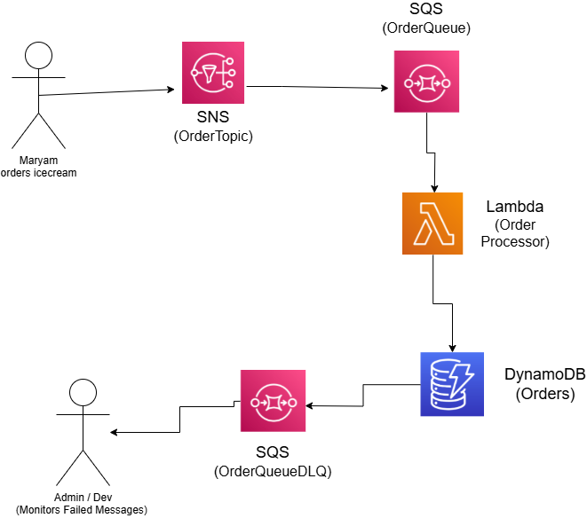

# OrdersCloudComputingAssignment

# Event-Driven Order Notification System on AWS

---

## Overview
This project implements an **event-driven order processing system** for an e-commerce platform using AWS services. The system:
1. Accepts orders via SNS notifications,
2. Buffers orders in an SQS queue,
3. Processes orders using Lambda,
4. Stores order data in DynamoDB,
5. Handles failures with a Dead-Letter Queue (DLQ).

---

## Architecture Diagram
  
*Flow: Client -> SNS Topic → SQS Queue → Lambda → DynamoDB*

---

## Prerequisites
- An **AWS Account** with permissions to:
  - Create/manage DynamoDB, SNS, SQS, Lambda, and IAM resources..
- Basic familiarity with the **AWS Management Console**.

---

## Step-by-Step Setup

### 1. DynamoDB Table Setup
**Objective**: Create a table to store order data.  
**Steps**:
1. Go to the **DynamoDB Console** → **Create Table**.
2. Configure:
   - **Table name**: `Orders`
   - **Partition key**: `orderId` (String)
3. Add other attributes during data insertion (`userId`, `itemName`, `quantity`, `status`, `timestamp`).
4. Keep default settings → Click **Create**.

### Step 2: Amazon SNS Topic Setup  
**Objective**: Create an SNS Topic to broadcast order events.  
**Steps**:  
1. Navigate to **Amazon SNS Console** → **Create Topic**.  
2. Configure:  
   - **Type**: Standard  
   - **Name**: `OrderTopic`  
3. Note the **Topic ARN**.  

---

### Step 3: Amazon SQS Queue with DLQ  
**Objective**: Create a queue to buffer orders and handle failures.  
**Steps**:  
1. **Create Dead-Letter Queue (DLQ)**:  
   - Go to **Amazon SQS Console** → **Create Queue** → **Name**: `OrderDLQ` → **Create**.  
2. **Create Main Queue**:  
   - **Name**: `OrderQueue`  
   - Under **Dead-letter queue** → **Enable** → Select `OrderDLQ`.  
   - **Maximum receives**: `3` (retries before DLQ).  
3. **Subscribe SQS to SNS**:  
   - Open `OrderQueue` → **Subscribe to Amazon SNS Topic** → Select `OrderTopic` → **Save**.

---

### Step 4: AWS Lambda Function Setup  
**Objective**: Process SQS messages and save orders to DynamoDB.  
**Steps**:  
1. **Create Lambda Function**:  
   - Go to **Lambda Console** → **Create Function** → **Name**: `OrderProcesor`.  
2. **Write Lambda Code** (Python): Copy the code.py file.
3. **Add SQS Trigger**: In Lambda → Add Trigger → Select OrderQueue → Batch size: 1.
4. **Configure IAM Permissions**: Attach policies: AmazonDynamoDBFullAccess and AmazonSQSFullAccess.
---

### Step 5: Testing
**Objective**: Validate the full event-driven flow.  
**Steps**:    
   - Go to **SNS Console** → **OrderTopic** → **Publish Message**. 
2. **Use this json**:
     
{
  "orderId": "01234",
  "userId": "U123",
  "itemName": "Laptop",
  "quantity": 1,
  "status": "new",
  "timestamp": "2025-05-03T12:00:00Z"
}

---

